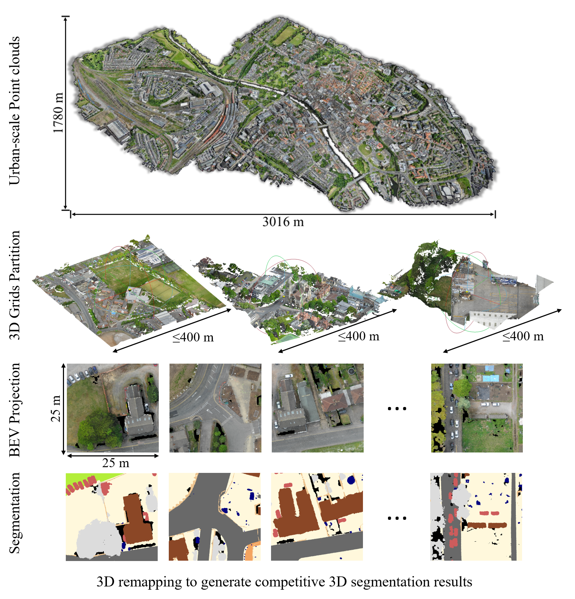
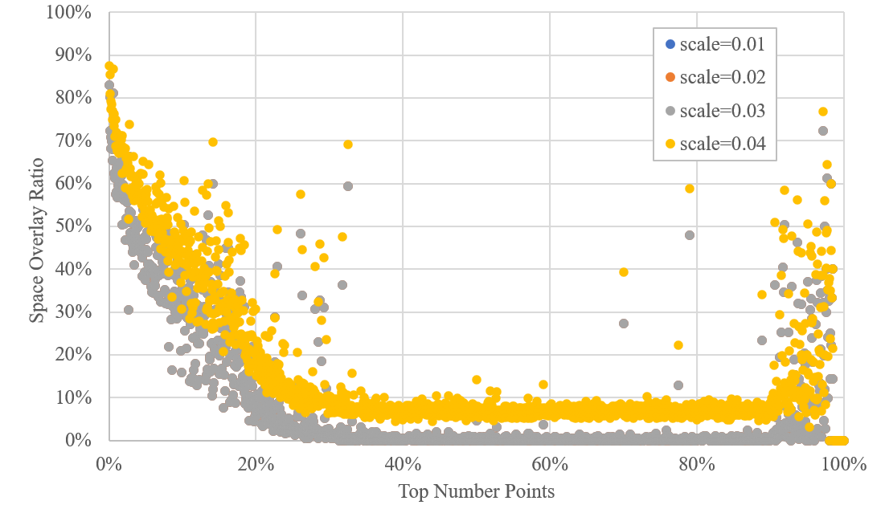
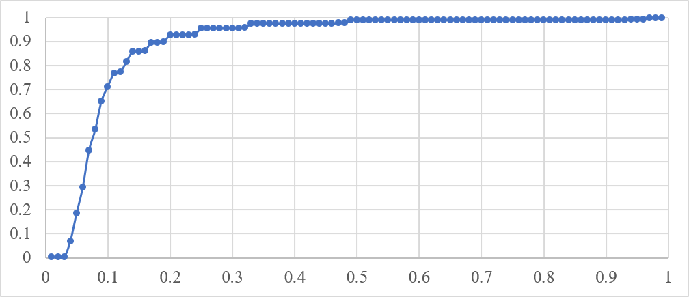
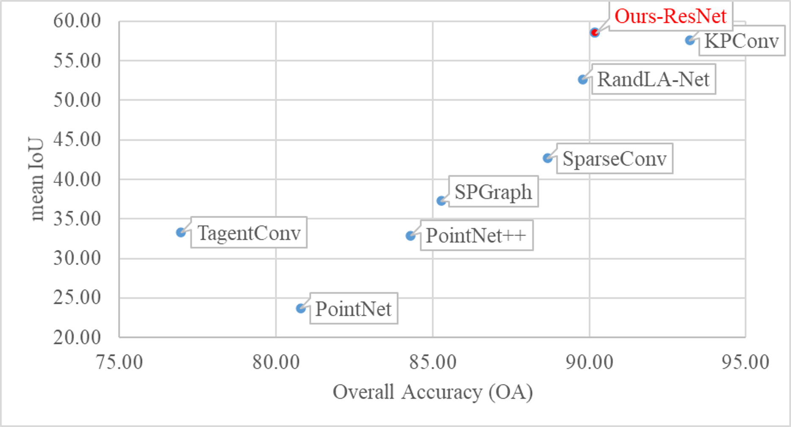
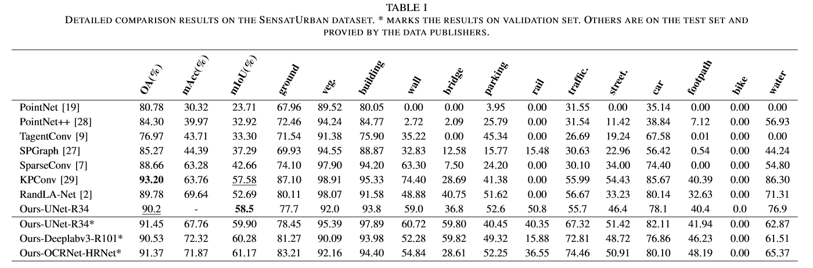

# SensatUrban-BEV-Seg3D

```markdown
[](https://paperswithcode.com/sota/3d-semantic-segmentation-on-sensaturban?p=efficient-urban-scale-point-clouds)
```

This is the official implementation of our BEV-Seg3D-Net, an efficient 3D semantic segmentation framework for Urban-scale point clouds like SensatUrban, Campus3D, etc. <br />

Features of our framework/model:
- leveraging various proven methods in 2D segmentation for 3D tasks
- achieve competitive performance in the SensatUrban benchmark
- fast inference process, about 1km^2 area per minute with RTX 3090.

To be done:
 - [ ] add more complex/efficient fusion models
 - [ ] add more backbone like ResNeXt, HRNet, DenseNet, etc.
 - [ ] add more novel projection methods like pointpillars

For technical details, please refer to:

**[Efficient Urban-scale Point Clouds Segmentation with BEV Projection](https://arxiv.org/abs/2109.09074)** <br />
Zhenhong Zou, Yizhe Li, Xinyu Zhang

Please cite by:

```
@article{Zou2021EfficientUP,
  title={Efficient Urban-scale Point Clouds Segmentation with BEV Projection},
  author={Zhenhong Zou and Yizhe Li},
  journal={ArXiv},
  year={2021},
  volume={abs/2109.09074}
}
```


<p align='center'>  </p>

### (1) Setup
This code has been tested with Python 3.7, PyTorch 1.8, CUDA 11.0 on Ubuntu 16.04. PyTorch of earlier versions should be supported.

- Clone the repository
```
git clone https://github.com/zouzhenhong98/SensatUrban-BEV-Seg3D.git & cd SensatUrban-BEV-Seg3D
```

- Setup python environment
```
conda create -n bevseg python=3.7
source activate bevseg
pip install -r requirements.txt
```

### (2) Preprocess
We provide various data analysis and preprocess methods for the SensatUrban dataset. (Part of the following steps are optional)

- Before data generation, change the path_to_your_dataset in preprocess/point_EDA_31.py by:
```
Sensat = SensatUrbanEDA()
Sensat.root_dir = 'path_to_your_dataset'
Sensat.split = 'train' # change to 'test' for inference
```

- Initialize the BEV projection arguments. We provide our optimal setting below, but you can set other values for analysis:
```
Sensat.grids_scale = 0.05
Sensat.grids_size = 25
Sensat.grids_step = 25
```

- (Optional) If you want to test the sliding window points generator:
```
data_dir = os.path.join(self.root_dir, self.split)
ply_list = sorted(os.listdir(data_dir))[0]
ply_path = os.path.join(data_dir, ply_name)
ply_data = self.load_points(ply_path, reformat=True)
grids_data = self.grid_generator(ply_data, self.grids_size, self.grids_step, False) # return an Iterator
```

- Calculating **spatial overlap ratio** in BEV projection:
```
Sensat.single_ply_analysis(Sensat.exp_point_overlay_count) # randomly select one ply file
Sensat.batch_ply_analysis(Sensat.exp_point_overlay_count) # for all ply files in the path
```

- Calculating **class overlap ratio** in BEV projection, that means we ignore overlapped points belonging to the same category:
```
Sensat.single_ply_analysis(Sensat.exp_class_overlay_count) # randomly select one ply file
Sensat.batch_ply_analysis(Sensat.exp_class_overlay_count) # for all ply files in the path
```

- Test BEV projection and **3D remapping with IoU index test** (reflecting the consistency in 3D Segmentation and BEV Segmentation tasks):
```
Sensat.evaluate('offline', Sensat.map_offline_img2pts)
```

- BEV data generation:
```
Sensat.batch_ply_analysis(Sensat.exp_gen_bev_projection)
```

- Point Spatial Overlap Ratio Statistics at different projection scales

<p align='center'>  </p>
<p align='center'>  </p>

- More BEV projection testing results refers to our sample images: completion test at imgs/completion_test, edge detection with different CV operators at imgs/edge_detection, rgb and label projection samples at imgs/projection_sample

### (3) Training & Inference
We provide two basic multimodal fusion network developped from U-Net in the modeling folder, unet.py is the basic feature fusion, and uneteca.py is the attention fusion.

- Change the path_to_your_dataset in mypath.py and dataloaders/__init__.py >>> 'cityscapes'

- Train from sratch
```
python train.py --use-balanced-weights --batch-size 8 --base-size 500 --crop-size 500 --loss-type focal --epochs 200 --eval-interval 1
```

- Change the save_dir in inference.py

- Inference on test data
```
python inference.py --batch-size 8
```

- Prediction Results Visualization (RGB, altitude, label, prediction)
<p align='center'>  </p>

### (4) Evaluation
- Remap your BEV prediction to 3D and evaluate in 3D benchmark in preprocess/point_EDA_31.py (following the previous initialization steps):
```
Sensat.evaluate_batch(Sensat.evaluate_batch_nn(Sensat.eval_offline_img2pts))
```

<p align='center'>  </p>

<p align='center'>  </p>

### (5) Citation

If you find our work useful in your research, please consider citing: (Information is coming soon! We are asking the open-access term of the conference!)

### (6) Acknowledgment
- Part of our data processing code (read_ply and metrics) is developped based on https://github.com/QingyongHu/SensatUrban
- Our code of neural network is developped based on a U-Net repo from the github, but unfortunately we are unable to recognize the raw github repo. Please tell us if you can help.

### (7) Related Work
To learn more about our fusion segmentation methods, please refers to our previous work:

    @article{Zhang2021ChannelAI,
        title={Channel Attention in LiDAR-camera Fusion for Lane Line Segmentation},
        author={Xinyu Zhang and Zhiwei Li and Xin Gao and Dafeng Jin and Jun Li},
        journal={Pattern Recognit.},
        year={2021},
        volume={118},
        pages={108020}
    }
    
    @article{Zou2021ANM,
        title={A novel multimodal fusion network based on a joint coding model for lane line segmentation},
        author={Zhenhong Zou and Xinyu Zhang and Huaping Liu and Zhiwei Li and A. Hussain and Jun Li},
        journal={ArXiv},
        year={2021},
        volume={abs/2103.11114}
    }